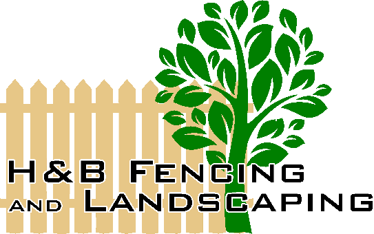

<!--  -->

# HB-Fencing

<!-- > Subtitle or Short Description Goes Here

> ideally one sentence

> include terms/tags that can be searched -->

# Short Description
H&B Fencing is an application to provide online quotes for fence projects for the end user.

# How It Works

## Client View
Users can visit the application and request a quote for their project.

 First they need to create an account, after they are logged in, They can begin the process of acquiring a quote.

They start entering their home address and choose how many sides
from their fence they need to install.

Then enter the information "Length in ft" on each side of the fence either the right side or the back side or any side of the fence.

And depending on what type of wood they want to use,  the price of the fence changes

They choose if they need a gate on either side of the fence and the width of the gate,  and if the gate is sigle gate or double gate
depending on what they choose, the price of each gate is reflected.

After entering the information for each side, they receive a quote with the price of each side.
so that they can show their neighbors the price of each side in case they decide to share the cost of the fence.

They have the option of accepting the quote and when accepting, the admin receives the quote in the admin account.
And the quote is stored in the database and displayed for the end user in their account in case They want to print the quote

## Admin View

In the admin view we have options to keek track
of each step of each project according to its state.

## Estimated State
The initial state is Call **Estimate** State where the end user required a quot but did not confirm it.

In this state we can only see the information since the end user did not ask for the service.

## Comfirmed State
The second state is called **Comfirmed** in this state the end user Comfirmed the quote, this means that the end user accepted the price and requires the services to install the fence

whether the end user confirmed it at the time the quote was requested or days or months after requesting it. They have the option of starting the installation process.
by login into their account.

After accepting the quote the admin receive the information
as a confirmed project.
at this point the admin has the option to start the project and move on to the other state called ** Active ** state

## Active State
In the active state, we have options to add expenses related to that project as 
miscellaneous
worker payments 
and material used in that project.

At this point the administrator has the option to cancel or finalize the project

## Done State
completed projects go to the **Done** state 
where the information of all finished projects is reflected.

## About

## Meet The Developers

      
| Bladimir Orellana | Esteban Morell Batista | Tahsin Nazmee |
| :---         |     :---:      |          ---: |
| git status   | git status     | git status    |
| git diff     | git diff       | git diff      |
  

## TOOLS

*React
*Redux
*Saga
*Express
*MongoDB
*Rest API
*Firebase

## License

